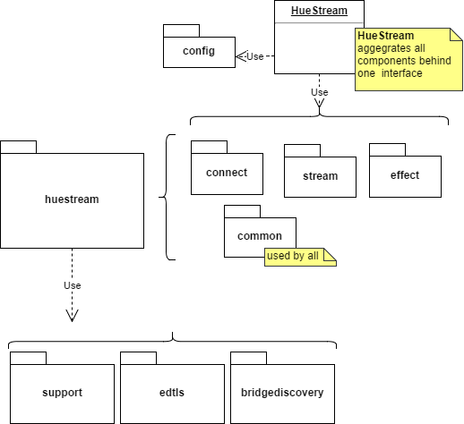

# EDK
The EDK (Entertainment Development Kit) main goal is to demonstrate how to use the streaming API's of the HUE system.
It is build and tested for Windows, Linux and MacOSX. Mobile platforms (Android / iOS) and game console platforms will come soon.

EDK has a libary `libhuestream` and developer support tools.

The library consits of 3 sub libraries:
* `huestream` (main library)
* `bridgediscovery` (discovering hue bridges)
* `support` (platform support)

Developer support tools include:
* `examples`
* `tools`
* `wrappers`

An external library is used for DTLS (security over UDP) support, which by default is `mbedTLS`.

## Component structure EDK
EDK consists of a number of components shown in the following picture:

## Common SDK libraries
EDK uses two parts of the regular HUE SDK:
* `support` for platform support primitives (networking, threading etc)
* `bridge_discovery` for bridge discovery primitives (UPNP/NUPNP/IPSCAN)
These libraries are also included into EDK repository.

In principle porting EDK to other platforms should only require adding and or changing interfaces in the support library.

## `huestream`
This is the core library of EDK. It consists of the following components
* `huestream/common/` contains shared functionality for the other components
* `huestream/config/` contains configuration settings
* `huestream/connect/` contains state machine to connect to a bridge
* `huestream/stream/` contains the main streaming API to stream light updates
* `huestream/effect/` contains an effect rendering engine to render layered effects
* `huestream/HueStream.h` is the main interface for EDK. This class aggregates `connect`, `stream` and
`effect`.

The `HueStream` class is setup by default to use the `connect`, `stream` and `effect` components. Yet depending on
your requirements components can be left out or replaced by own implementations. For instance, if you only want to use
the `connect` and `stream` component, but not the rendering of `effect`, then modify the `HueStream` implementation.

More information on the concepts used can be found in /doc/EDK_concepts.pdf

## `examples`
To hit the ground running some examples have been created:
* `examples/huestream_example_console/` Small commandline executable showing library in action with connection flow and some effects
* `examples/huestream_example_gui_win/` Windows test tool making bridge connection and effect playing available with a GUI

## Building EDK
Get EDK archive:

    git clone <url/to>/EDK.git

As main build system CMAKE is used, please install the latest version from `https://cmake.org/`

### CMAKE Build options
The following CMAKE options are supported:

 Option | Description
:---|:---
 `BUILD_TEST`               | toggles building of tests |
 `BUILD_EXAMPLES`           | toggles building of examples
 `BUILD_CURL`               | toggles building of CURL
 `BUILD_WRAPPERS`           | toggles building of wrappers, currently only C# and Java (requires RTTI and Exceptions enabled)
 `BUILD_SWIG`               | toggles building of SWIG, when switched to off make sure to use latest SWIG version 3.0.10
 `BUILD_WITH_RTTI`          | toggles RTTI (libary does not require RTTI)
 `BUILD_WITH_EXCEPTIONS`    | toggles exceptions (library does not require exceptions)

Use these vars on the commandline:
    `cmake -D <option>=[ON|OFF] <Toplevel CMakeList.txt directory>`

#### Not building curl
When not building CURL you need to specify where to find CURL by setting extra variables. Two options:
1. Set `CURL_INSTALL_DIR` variable we assume the following structure:
    ${CURL_INSTALL_DIR}
              /lib               --> contains the library
              /bin               --> contains the dll (windows)
              /include           --> contains the header files
2. Set the following variables: `CURL_LIB_DIR`, `CURL_INC_DIR` and on windows also `CURL_BIN_DIR`.
              ${CURL_LIB_DIR}    --> contains the library
              ${CURL_BIN_DIR}    --> contains the dll (windows)
              ${CURL_INC_DIR}    --> contains the header files

### Linux
The main linux distribution supported is ubuntu 16.04 LTS. Compiling requires an GCC5 or Clang (c++11 needed).
    `sudo apt-get install build-essential`

When generating C#/Java wrappers install mono/JDK:
    `sudo apt-get install mono`
    `sudo apt-get install openjdk-8-jdk`

For our development we used the cross-platform environment by JetBrains: clion

Recommend to use clion to load the CMAKE project or generate Eclipse projects and build from there.
To build from command prompt, follow the lines below:

    cd root-of-repo
    mkdir build
    cd build
    cmake  ..
    make

### Windows Visual Studio
Make sure to install cmake and be able to execute it from command line. Since cmake needs to access git from the
commandline as well (to clone external archives mbedtls and curl), make sure that the PATH environment variable is also 
pointing to the git install directory.

Tested development environment is VS2015 with both 32 and 64 bit compilers.

Open command prompt and execute the following to generate VS projects.

    cd root-of-repo
    mkdir build
    cd build
    cmake -G "Visual Studio 14 2015" ..

Open the generated VS solution and build

### Windows CLION
Secondary development environment is clion. We used MINGW-w64 as both 32 and 64 bit compiler in clion.

## Getting Started
Getting started is easy. It just takes 3 steps.

__(1) Setup the HueStream library__

Most configuration settings can be found in the `Config` class. Although you can tweak many things there, by default
you only have to pass the application and platform name that is used for identification with the Hue bridge.

    //Configure
    auto config = std::make_shared<Config>(appName, platform);

Next thing is to register the connection flow feedback callback, which will be called when connecting to the HUE bridge.
(Alternative option is to inject a feedbackhandler using RegisterFeedbackHandler.)

    //Create the HueStream instance to work with
    //Maintain this instance as a single instance per bridge in the application
    auto huestream = std::make_shared<HueStream>(config);

    //Register feedback callback
    huestream->RegisterFeedbackCallback({
        //Handle connection flow feedback messages here to guide user to connect to the HUE bridge
        //Here we just write to stdout
        if (message.GetType() == FeedbackMessage::ID_FEEDBACK_TYPE_USER) {
            std::cout << message.GetUserMessage() << std::endl;
        }
        if (message.GetId() == FeedbackMessage::ID_DONE_COMPLETED) {
            std::cout << "Connected to bridge with ip: " << message.GetBridge()->GetIpAddress() << std::endl;
        }
    });

__(2) Connect to bridge__

Next is to connect to the bridge with either:
* `huestream->ConnectBridge()` for synchronous (blocking) execution
* `huestream->ConnectBridgeAsync()` for  asynchronous (non-blocking) execution

In this tutorial we choose for a blocking connect call. The registered callback from step (1) indicates
progress, errors and required user actions. In a normal situation, the only user action is at first time
connection, where the user will be requested to press the `link button` on the bridge.

In addition the application needs to handle the case when a user has configured multiple entertainment setups.
In this case application ask the user to selected one.

In an exceptional
situation where something is wrong with the configuration of the bridge, the user will be requested to solve
this using the setup tool of the Hue App. The only case where the application needs to handle anything is when a
user has configured multiple entertainment setups: in this case one should be selected to use for this application.

More info on the ConnectionFlow: `doc/ApplicationNote_HueEDK_ConnectionFlow.pdf`

    //Connect to the bridge synchronous
    huestream->ConnectBridge();

    while (!huestream->IsStreamableBridgeLoaded()) {
        auto bridge = huestream->GetLoadedBridge();
        if (bridge->GetStatus() == BRIDGE_INVALID_GROUP_SELECTED) {
            //A choice should be made between multiple groups
            //Here we just pick the first one in the list
            huestream->SelectGroup(bridge->GetGroups()->at(0));
        } else {
            PressAnyKeyToRetry();
            huestream->ConnectBridge();
        }
    }

__(3) Play effects on lights__

The HueStream library has several example effects. Conventions are:
* Colors are in RGB channels between 0 and 1
* Times are integers in milliseconds
* Locations / distances are relative to a users room/setup which approximately spans from -1 to 1 in both x (left to right) and y (back to front)
* Speed (not used in this example) is a multiplication factor over the speed of animations within the effect (i.e. default 1)

In this tutorial we are using the `ExplosionEffect` to render an explosion in the middle of the room.

    //Create an explosion effect object
    auto layer = 0;
    auto name = "my-explosion";
    auto explosion = std::make_shared<ExplosionEffect>(name, layer);

    //Configure the explosion with color and explosion behaviour and position
    auto colorRGB = Color(1, 0.8, 0.4);
    auto locationXY = Location(0, 0);
    auto radius = 0.5;
    auto duration_ms = 2000;
    auto expAlpha_ms = 50;
    auto expRadius_ms = 100;
    
    explosion->PrepareEffect(colorRGB, locationXY, radius, duration_ms, expAlpha_ms, expRadius_ms);

    //Play the effect
    huestream->LockMixer();
    huestream->AddEffect(explosion);
    explosion->Enable();
    huestream->UnlockMixer();

Next to example effects like an explosion there are more generalized base classes available to build custom effects on top of.
One example is a lightSourceEffect (where also the explosionEffect is based on) which provides options to specify custom
curves for the color, position, radius, transparancy and speed of a lightsource over time. Another example is an areaEffect
which plays a certain color/brightness curve on all lights in a certain area. More info on effects: doc/EDK_concepts.pdf

As mentioned before, if a rendering engine is already available then it may be a good option to write a plugin directly
to the streaming interface. In that case, the EDK will provide the available lights with their positions and the engine
should provide back a stream of (RGB) colors per light.

## Customization

Many parts of the library can be customized. Some common ones are:
* The EDK by default uses a separate renderthread to render light frames and send them to the bridge. If you want to control this manually (eg within
a game loop), you can set useRenderThread to false in the config before creating HueStream in step 1 of above example, i.e. `config->GetAppSettings()->SetUseRenderThread(false)`. Now the application has to regularily call `huestream->RenderSingleFrame()`. In this case the locking as used in step 3 of above example is not needed.
* The EDK by default starts streaming immediately after connecting to a bridge. You can control that separately by setting `config->GetAppSettings()->SetAutoStartAtConnection(false)`. Then the application has to manually call `huestream->Start()` or `huestream->StartAsync()` to start streaming.
* etc

## `tools`
The EDK has a small simulator and bridge monitor for the HUE streaming interface. It is based on nodejs.

### on windows
Make sure to install nodejs: `https://nodejs.org/en/download/`
After install open command prompt and execute the following:

    cd root-of-repo/tools/simulator
    install.cmd

Next you can start the simulator with

    cd root-of-repo/tools/simulator
    start.cmd
Make sure to allow firewall access....

### on linux
Make sure to install nodejs: `https://nodejs.org/en/download/`
After install open command prompt and execute the following:

    cd root-of-repo/tools/simulator
    ./install.sh

Next you can start the simulator with

    cd root-of-repo/tools/simulator
    ./start.sh
Make sure to allow firewall access....
Might require sudo depending on you settings

### usage
Navigate to

    http://localhost

The simulator allows you visualize incomming streaming messages on the location grid. In the client app specify ip address of the
machine running the simulator (or localhost if this is the same machine). Any username is accepted. To work with the simulator, the
transport layer security (DTLS) should be disabled: in your app simply make sure you set StreamingMode to `STREAMING_MODE_UDP` in
the Config instance:

    auto config = make_shared<huestream::Config>("my-app", "pc");
    config->SetStreamingMode(STREAMING_MODE_UDP);
    auto huestream = make_shared<huestream::HueStream>(config);

### config the entertainment setup used by the simulator
By default there are 4 different setups available in the simulator defined in `tools/simulator/server/config/default_groups.json`
The simulator creates a file `tools/simulator/server/config/current_groups.json` that stores state and any modifications you make to the groups.
Simply removing this file will reset to the default groups.

## `wrappers`
For C# and Java support SWIG is used to generate the bindings. This is experimental still. Objective-C and Python will follow soon.
By having cmake option BUILD_WRAPPERS=ON and running the huestream_csharp or huestream_java target, an example project (Visual Studio or Eclipse) will be generated in the output directory.

## `doxygen`
Doxygen API documentation can be generated by running `doxygen Doxyfile`

## `licences`

### EDK

The following external libraries are used in certain build variants:

* HTTP: libcurl - MIT style license [https://curl.haxx.se/docs/copyright.html](https://curl.haxx.se/docs/copyright.html)
  * Version: 7.50.3
  * Package is automatically downloaded during compilation
  * Patch is part of this repository and can be found in `cmake/patches`

* DTLS: mbedTLS - Apache 2.0 license 
  * Version: 2.3.0
  * Package is automatically downloaded during compilation
  * Patches are part of this repository and can be found in `cmake/patches` and PATCHES directory in the root

* JSON: libjson - Simplified (2-clause) BSD license
  * Version: 7.6.1
  * Package is part of this repository and can be found in `libhuestream/3rd_party/libjson`

* SWIG - GPLv3 license
  * Version: 3.0.12
  * Package is automatically downloaded during compilation
  * For more information see [http://www.swig.org/legal.html](http://www.swig.org/legal.html)

* Cpplint
  * Package is part of this repository and can be found in `tools/cpplint`
  
See `OSSlicenses.txt`for all the licenses

